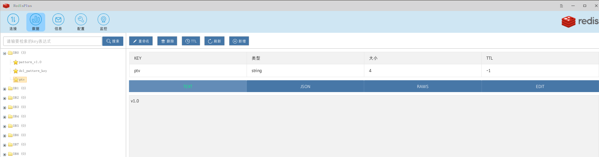
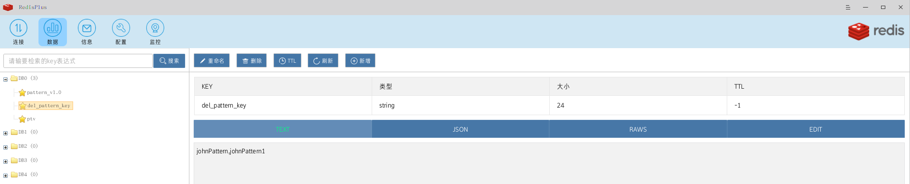
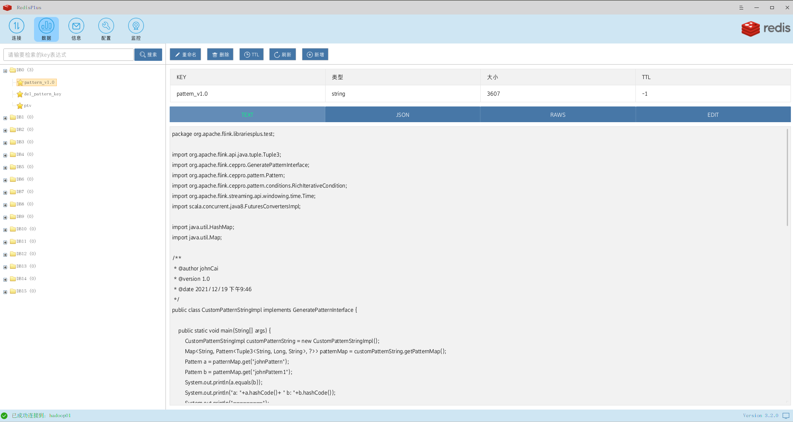

# flink-librariespro 一个可以支持一条流多个pattern cep库

## 支持动态改变pattern，动态改变个数和pattern的内容 
## 动态pattern代码热更新目前只支持了java，后续将支持scala
---
测试通过, demo `org.apache.flink.librariesplus.test.MultPatternTest`

日志格式：

    output> a,1000000001,22
    2021-12-29 23:05:45,490 INFO  org.apache.flink.librariesplus.test.MyPatternChangeListener   - in Pattern Change Lister funcation get pattern version.
    2021-12-29 23:05:45,510 INFO  org.apache.flink.librariesplus.test.MyPatternChangeListener   - in Pattern Change Lister funcation getNewPatternString.
    2021-12-29 23:05:45,510 INFO  org.apache.flink.librariesplus.test.MyPatternChangeListener   - in Pattern Change Lister funcation get pattern version.
    2021-12-29 23:05:45,511 INFO  org.apache.flink.librariesplus.test.MyPatternChangeListener   - in Pattern Change Lister funcation getNewPatternString. pattern: 
    package org.apache.flink.librariesplus.test;
    
    import org.apache.flink.api.java.tuple.Tuple3;
    import org.apache.flink.ceppro.GeneratePatternInterface;
    import org.apache.flink.ceppro.pattern.Pattern;
    import org.apache.flink.ceppro.pattern.conditions.RichIterativeCondition;
    import org.apache.flink.streaming.api.windowing.time.Time;
    import scala.concurrent.java8.FuturesConvertersImpl;
    
    import java.util.HashMap;
    import java.util.Map;
    
    /**
     * @author johnCai
     * @version 1.0
     * @date 2021/12/19 下午9:46
     */
    public class CustomPatternStringImpl implements GeneratePatternInterface {
    
        public static void main(String[] args) {
            CustomPatternStringImpl customPatternString = new CustomPatternStringImpl();
            Map<String, Pattern<Tuple3<String, Long, String>, ?>> patternMap = customPatternString.getPatternMap();
            Pattern a = patternMap.get("johnPattern");
            Pattern b = patternMap.get("johnPattern1");
            System.out.println(a.equals(b));
            System.out.println("a: "+a.hashCode()+ " b: "+b.hashCode());
            System.out.println("=========");
        }
    
        public Map<String,Pattern<Tuple3<String, Long, String>,?>> getPatternMap() {
            Pattern<Tuple3<String, Long, String>, ?> pattern = Pattern
                    .<Tuple3<String, Long, String>>begin("start")
                    .where(new RichIterativeCondition<Tuple3<String, Long, String>>() {
                        @Override
                        public boolean filter(Tuple3<String, Long, String> value, Context<Tuple3<String, Long, String>> ctx) throws Exception {
                            return value.f0.equals("a");
                        }
                    })
                    .followedBy("middle")
                    .where(new RichIterativeCondition<Tuple3<String, Long, String>>() {
                        @Override
                        public boolean filter(Tuple3<String, Long, String> value, Context<Tuple3<String, Long, String>> ctx) throws Exception {
                            return value.f0.equals("b");
                        }
                    }).oneOrMore()
                    .within(Time.seconds(5));
            Pattern<Tuple3<String, Long, String>, ?> pattern1 = Pattern
                    .<Tuple3<String, Long, String>>begin("start1")
                    .where(new RichIterativeCondition<Tuple3<String, Long, String>>() {
                        @Override
                        public boolean filter(Tuple3<String, Long, String> value, Context<Tuple3<String, Long, String>> ctx) throws Exception {
                            return value.f0.equals("a");
                        }
                    })
                    .followedBy("middle1")
                    .where(new RichIterativeCondition<Tuple3<String, Long, String>>() {
                        @Override
                        public boolean filter(Tuple3<String, Long, String> value, Context<Tuple3<String, Long, String>> ctx) throws Exception {
                            return value.f0.equals("c");
                        }
                    }).or(new RichIterativeCondition<Tuple3<String, Long, String>>() {
                        @Override
                        public boolean filter(Tuple3<String, Long, String> value, Context<Tuple3<String, Long, String>> ctx) throws Exception {
                            return value.f0.equals("d");
                        }
                    }).oneOrMore()
                    .within(Time.seconds(10));
            Map<String, Pattern<Tuple3<String, Long, String>, ?>> patternMap = new HashMap<String, Pattern<Tuple3<String, Long, String>, ?>>(1);
            patternMap.put("johnPattern", pattern);
            patternMap.put("johnPattern1",pattern1);
            return patternMap;
        }
    }
    
    2021-12-29 23:05:45,532 INFO  org.apache.flink.ceppro.operator.CepOperator                  - update pattern johnPattern
    2021-12-29 23:05:45,532 INFO  org.apache.flink.ceppro.operator.CepOperator                  - update pattern johnPattern1
    2021-12-29 23:05:45,533 INFO  org.apache.flink.librariesplus.test.MyPatternChangeListener   - in Pattern Change Lister funcation getDelPatternKey.
    2021-12-29 23:05:45,533 INFO  org.apache.flink.librariesplus.test.MyPatternChangeListener   - in Pattern Change Lister funcation getDelPatternKey. delList: [johnPattern1, johnPattern]
    output> b,1000000002,23
    2021-12-29 23:05:51,586 INFO  org.apache.flink.librariesplus.test.MyPatternChangeListener   - in Pattern Change Lister funcation get pattern version.
    john out> {(johnPattern,start)=[(a,1000000001000,22)], (johnPattern,middle)=[(b,1000000002000,23)]}
    output> a,1000000003,23
    2021-12-29 23:05:55,893 INFO  org.apache.flink.librariesplus.test.MyPatternChangeListener   - in Pattern Change Lister funcation get pattern version.
    output> c,1000000004,23
    2021-12-29 23:06:00,301 INFO  org.apache.flink.librariesplus.test.MyPatternChangeListener   - in Pattern Change Lister funcation get pattern version.
    john out> {(johnPattern1,middle1)=[(c,1000000004000,23)], (johnPattern1,start1)=[(a,1000000001000,22)]}
    john out> {(johnPattern1,middle1)=[(c,1000000004000,23)], (johnPattern1,start1)=[(a,1000000003000,23)]}
    output> b,1000000005,23
    2021-12-29 23:06:04,907 INFO  org.apache.flink.librariesplus.test.MyPatternChangeListener   - in Pattern Change Lister funcation get pattern version.
    john out> {(johnPattern,start)=[(a,1000000001000,22)], (johnPattern,middle)=[(b,1000000002000,23), (b,1000000005000,23)]}
    john out> {(johnPattern,start)=[(a,1000000003000,23)], (johnPattern,middle)=[(b,1000000005000,23)]}
    output> d,1000000005,23
    output> d,1000000006,23
    2021-12-29 23:06:14,723 INFO  org.apache.flink.librariesplus.test.MyPatternChangeListener   - in Pattern Change Lister funcation get pattern version.
    john out> {(johnPattern1,middle1)=[(c,1000000004000,23), (d,1000000006000,23)], (johnPattern1,start1)=[(a,1000000001000,22)]}
    john out> {(johnPattern1,middle1)=[(c,1000000004000,23), (d,1000000006000,23)], (johnPattern1,start1)=[(a,1000000003000,23)]}
    output> e,1000000010,23
    2021-12-29 23:06:18,931 INFO  org.apache.flink.librariesplus.test.MyPatternChangeListener   - in Pattern Change Lister funcation get pattern version.
    output> a,1000000011,23
    2021-12-29 23:06:23,336 INFO  org.apache.flink.librariesplus.test.MyPatternChangeListener   - in Pattern Change Lister funcation get pattern version.
    output> b,1000000012,23
    2021-12-29 23:06:26,941 INFO  org.apache.flink.librariesplus.test.MyPatternChangeListener   - in Pattern Change Lister funcation get pattern version.
    john out> {(johnPattern,start)=[(a,1000000011000,23)], (johnPattern,middle)=[(b,1000000012000,23)]}
    

---

输入数据：

    a,1000000001,22
    b,1000000002,23
    a,1000000003,23
    c,1000000004,23
    b,1000000005,23
    d,1000000005,23
    d,1000000006,23
    e,1000000010,23
    a,1000000011,23
    b,1000000012,23
    
---

redis样例数据

---
pattern versionKey

del pattern keys

new pattern string

